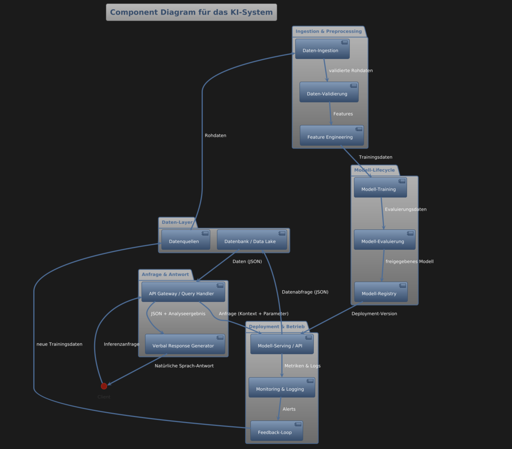
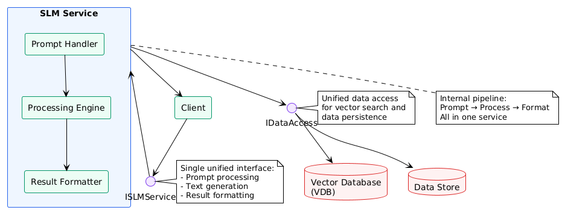

# Component Diagram für das KI-Systems

## Training (PDF)


## Abfrage (SLM)



``` uml
@startuml
!theme plain
skinparam backgroundColor #FFFFFF
skinparam packageStyle rectangle
skinparam componentStyle rectangle
skinparam databaseStyle rectangle

' Define colors
skinparam package {
    BorderColor #2563EB
    BackgroundColor #EFF6FF
}

skinparam component {
    BorderColor #059669
    BackgroundColor #ECFDF5
}

skinparam database {
    BorderColor #DC2626
    BackgroundColor #FEF2F2
}

skinparam interface {
    BorderColor #7C3AED
    BackgroundColor #F3E8FF
}

' Main packages
package "Monitor" as monitor {
    [File Watcher] as filewatcher
}

package "Server Share" as servershare {
    [Directory] as directory
}

package "Vectorizer" as vectorizer {
    [Tika] as tika
    [Image Processing] as imageproc
}

' Databases
database "Vector Database\n(VDB)" as vdb
database "Relational Database\n(RDBMS)" as rdbms

' Interfaces
interface "IFileMonitor" as ifilemonitor
interface "IVectorizer" as ivectorizer
interface "IDataAccess" as idataaccess

' Connections within packages
filewatcher --> directory : watches

' Interface connections
monitor --> ifilemonitor
ifilemonitor --> ivectorizer
ivectorizer --> vectorizer

monitor --> idataaccess
idataaccess --> vdb
idataaccess --> rdbms

vectorizer --> vdb : stores vectors
vectorizer --> rdbms : stores metadata

' Notes for clarity
note right of ifilemonitor
    File monitoring events
    and change notifications
end note

note right of ivectorizer
    Document processing
    and vectorization requests
end note

note right of idataaccess
    Database operations
    and data persistence
end note
@enduml
```


``` uml
@startuml
!theme plain
skinparam backgroundColor #FFFFFF
skinparam packageStyle rectangle
skinparam componentStyle rectangle
skinparam databaseStyle rectangle

' Define colors
skinparam package {
    BorderColor #2563EB
    BackgroundColor #EFF6FF
}

skinparam component {
    BorderColor #059669
    BackgroundColor #ECFDF5
}

skinparam database {
    BorderColor #DC2626
    BackgroundColor #FEF2F2
}

skinparam interface {
    BorderColor #7C3AED
    BackgroundColor #F3E8FF
}

' Simplified architecture with single SLM
package "SLM Service" as slmservice {
    [Prompt Handler] as prompthandler
    [Processing Engine] as processingengine
    [Result Formatter] as resultformatter
}

[Client] as client

' Databases
database "Vector Database\n(VDB)" as vdb
database "Data Store" as datastore

' Interfaces
interface "ISLMService" as islmservice
interface "IDataAccess" as idataaccess

' Main flow
client --> islmservice
islmservice --> slmservice

' Internal SLM flow
prompthandler --> processingengine
processingengine --> resultformatter

' Data access
slmservice --> idataaccess
idataaccess --> vdb
idataaccess --> datastore

' Response back to client
slmservice --> client

' Notes
note right of islmservice
    Single unified interface:
    - Prompt processing
    - Text generation
    - Result formatting
end note

note right of idataaccess
    Unified data access
    for vector search and
    data persistence
end note

note bottom of slmservice
    Internal pipeline:
    Prompt → Process → Format
    All in one service
end note
@enduml
```